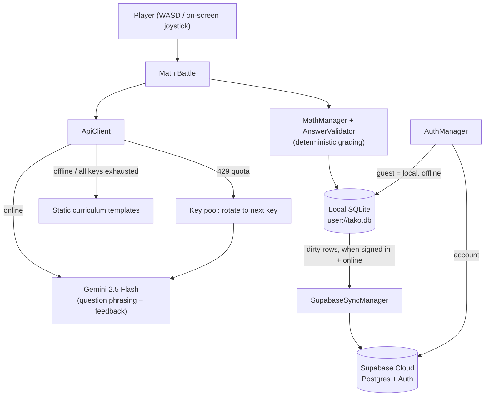

# TAKO — Teaching with Adaptive Knowledge Orchestration


TAKO is a mobile-first, offline-first educational math RPG built in **Godot 4 (GDScript)** for Android. It blends narrative roleplaying with a bilingual (English / Filipino) AI learning companion that generates curriculum-aligned math questions and adaptive, personalized feedback.

The entire experience — authentication, dashboard, and gameplay — ships as a **single Godot APK**.

---

## Table of Contents

1. [Project Overview](#1-project-overview)
2. [Key Features](#2-key-features)
3. [Technology Stack](#3-technology-stack)
4. [Architecture](#4-architecture)
5. [System Requirements](#5-system-requirements)
6. [Setup & Installation](#6-setup--installation)
7. [How to Play](#7-how-to-play)
8. [On-Device AI (Gemini Nano)](#8-on-device-ai-gemini-nano)
9. [Project Directory Structure](#9-project-directory-structure)
10. [Team Members & Roles](#10-team-members--roles)
11. [AI Usage Disclosure](#11-ai-usage-disclosure)
12. [Licenses & Third-Party Credits](#12-licenses--third-party-credits)

---

## 1. Project Overview

Players begin as a student inside a billiard hall (a nod to the development team, **Billiard Boys**). The player moves to a school building with **4 subject doors**: Mathematics, Science, Languages, and Philippine History. In this prototype the **Mathematics door is active**, demonstrating a scalable architecture ready to receive other subjects.

Behind the Mathematics door is a grade hall with classrooms for **Grades 7–10**. Progress is **non-gated** — players can enter any grade, backtrack, and review in any order. Encountering an enemy triggers a DepEd-curriculum math question. Answering incorrectly produces **AI-generated feedback** that reacts to the player's actual answer and gets more specific with each attempt, in the player's chosen language.

### Social Impact & UN SDGs Alignment

TAKO is designed to address educational and social disparities in developing nations, specifically targeting the Philippine public education system (DepEd curriculum). It directly aligns with the following UN Sustainable Development Goals:

- **SDG 4: Quality Education**
  - **Bilingual & Localized Learning:** Offers questions and explanations in both English and Tagalog/Filipino, ensuring students learn mathematical concepts in their primary language, which significantly enhances comprehension.
  - **Adaptive AI Guidance:** By using Google Gemini to construct encouraging, misconception-aware feedback, it replicates private tutoring at scale for students who cannot afford traditional tutoring.
  - **Non-Gated Curriculum:** Allows students to self-pace, revisit core concepts, and bridge knowledge gaps across Grade 7–10 math curriculums without punitive gating.
- **SDG 10: Reduced Inequalities**
  - **Offline-First Accessibility:** The local SQLite storage architecture enables full gameplay and local guest tracking without an internet connection. This bridges the digital divide for students in rural and low-connectivity regions.
  - **Zero-Barrier Guest Mode:** Anyone can download the app and play immediately as a guest. All data is kept locally on the device, requiring no email verification or credentials.

---

## 2. Key Features

- **Single consolidated app** — landing, sign in / sign up, dashboard, and the RPG all run inside one Godot project.
- **Offline-first** — a local SQLite database stores all player data. The game is fully playable with no network connection.
- **Flexible accounts** — play instantly as a **Guest** (fully offline), or create an **online account** (Supabase email/password) whose progress syncs to the cloud. If the backend is unreachable, sign-up/sign-in gracefully fall back to a local account.
- **Cloud sync** — when signed in online, local changes are pushed to Supabase automatically.
- **AI-generated content** — Google Gemini phrases each question uniquely and writes encouraging, misconception-aware feedback.
- **Bilingual** — English and Tagalog/Filipino throughout questions and feedback.

---

## 3. Technology Stack

| Layer | Technology |
|---|---|
| **Game Engine** | Godot Engine **4.6.2** (GDScript) |
| **Local Storage** | `godot-sqlite` addon (`user://tako.db`) |
| **Cloud Backend** | Supabase (PostgreSQL, GoTrue Auth, PostgREST) |
| **AI (online)** | Google **Gemini 2.5 Flash** (REST API) |
| **AI (on-device, scaffolded)** | Google Gemini Nano via Android AICore (see §8) |
| **AI (dev only)** | Ollama (local desktop testing) |

---

## 4. Architecture

### Data & AI flow



### Autoload singletons (`scripts/core/`)
- **`AuthManager`** — guest sessions (local UUID, offline), Supabase GoTrue email/password auth, offline local-account fallback, session persistence (`user://auth_session.json`).
- **`GameManager`** — app entry point; shows landing / dashboard based on session, and drives the RPG.
- **`SceneManager`** — level loading, transitions, and battles.
- **`PlayerDataManager`** — in-memory player facade persisted through SQLite.
- **`SupabaseSyncManager`** — pushes dirty local rows to Supabase (one-way local→cloud) on a timer when online and authenticated.
- **`ApiClient`** — AI provider abstraction (Gemini Flash / Gemini Nano / Ollama) with a static-template fallback.
- **`DatabaseManager`** (`scripts/SQLite/`) — SQLite schema, migrations, and data access.

### AI & phrasing separation
To avoid the LLM ever mis-grading math, **correctness logic is fully deterministic** and separated from natural-language generation:

| Responsibility | Handler | Rationale |
|---|---|---|
| **Math correctness** | Deterministic GDScript (`AnswerValidator`) | Answers are parsed/compared in code — never by the AI. Equivalent forms (`1/2`, `0.5`, `2/4`) are accepted. |
| **Misconception matching** | Rule-based templates (`QuestionTemplates`) | Wrong answers are matched to known error patterns before any AI call. |
| **Question & feedback phrasing** | Gemini 2.5 Flash | The AI turns verified specs/misconceptions into unique questions and escalating, in-character explanations. |

### Curriculum content
14 parameterized, deterministic templates in [question_templates.gd](scripts/gameplay/math/question_templates.gd):
- **Grade 7:** negative-integer arithmetic, simplifying fractions, decimal→fraction, linear equations, rectangle perimeter.
- **Grade 8:** exponent product rule, multi-step linear equations, slope between two points.
- **Grade 9:** quadratic discriminant, distance between points (Pythagorean), direct variation.
- **Grade 10:** median of a data set, circle circumference, probability (drawing from a bag).

If the AI is unavailable, deterministic question/feedback templates in `MathManager` are used instead, so gameplay never blocks.

---

## 5. System Requirements

- **Run the APK:** Android 7.0 (API 24) or higher (as configured in the Android export).
- **Network:** Optional. The game runs fully offline; online accounts and cloud sync activate when a connection is available.
- **On-device offline AI (Gemini Nano):** only on AICore-capable flagships (e.g., Pixel 8/9, Galaxy S24/S25). Not active in the current build — see §8.

---

## 6. Setup & Installation

### Option A — Install the prebuilt APK (easiest)
You don't need Godot or any build tools to play. A ready-to-install **`TakoGame.apk`** is provided with the project.

1. Copy `TakoGame.apk` to your Android device (or an emulator such as MuMu Player).
2. Open it and allow installation from unknown sources if prompted.
3. Launch **TAKO** and tap **Play as Guest** to start immediately, or **Sign In / Sign Up** for a cloud account.

The Supabase and Gemini keys are already bundled in this build, so online accounts, cloud sync, and AI work out of the box (with an internet connection). The game is also fully playable offline.

> Via ADB: `adb install -r TakoGame.apk`

### Option B — Run / build from source

#### Prerequisites
- **Godot Engine 4.6.2** (standard build).
- For Android export: **Android export templates** (Godot → Editor → Manage Export Templates) and a configured **Android SDK / keystore**.

#### Run in the editor
1. Clone the repository:
   ```bash
   git clone https://github.com/russellmagdaong/tako-game.git
   ```
2. Open the project in **Godot 4.6.2** (import `project.godot`). The first import builds the asset cache.
3. Configure the **Gemini API key** (required for AI; kept out of git):
   - Create a file named `.env` in the project root (`res://.env`) with:
     ```
     GEMINI_API_KEY="your-google-gemini-api-key"
     ```
   - Get a key from [Google AI Studio](https://aistudio.google.com/apikey). `.env` is gitignored and bundled into the APK via the export filter.
4. The **Supabase URL and anon key** are already set in `project.godot` under the `[tako]` section. To point at your own project, edit `tako/supabase/url` and `tako/supabase/anon_key`.
5. Press **F5** to run. You'll land on the title screen — tap **Play as Guest** to start immediately, or **Sign In / Sign Up** for an online account.

#### Build the Android APK
1. Project → **Export** → select the **Android** preset (outputs `../TakoGame.apk`).
2. Ensure a debug/release keystore is configured, then **Export Project**.
3. Install on a device/emulator (e.g., `adb install -r TakoGame.apk`).

#### Backend (Supabase) setup
If you use your own Supabase project, the app expects these tables: `profiles`, `progress`, `question_attempts`, `player_state`, `defeated_enemies`, `achievements`, `triggered_dialogues`, `subjects` (column shapes match `TABLE_CONFIG` in [supabase_sync_manager.gd](scripts/core/supabase_sync_manager.gd)).

For online accounts and cloud sync to work:
- Enable **Row-Level Security** policies allowing each authenticated user to manage their own rows (`auth.uid() = user_id`, and `auth.uid() = id` for `profiles`), plus a `handle_new_user` trigger to create a `profiles` row on signup.
- For frictionless testing, disable email confirmation under **Authentication → Sign In / Providers → Email**, or configure custom **SMTP** (the built-in email service is heavily rate-limited).

---

## 7. How to Play

**Goal:** Explore the school, enter the Mathematics door, and clear math battles across Grades 7–10.

**Movement & Exploration**

For Keyboard & Mouse
- **Move:** `W` `A` `S` `D`
- **Run:** hold `Shift`
- **Interact / advance dialogue:** `E`
- **Menu:** click the gear icon (top-left) for settings / return to dashboard

For Touch Controls
- **Move:** touch and hold anywhere on the **left half** of the screen — a virtual joystick appears under your thumb; drag to steer.
- **Interact / advance dialogue:** tap the **E** button in the bottom-right corner.
- **Menu:** tap the gear icon (top-left) for settings / return to dashboard.
- *Running is keyboard-only; on touch the character moves at walking speed.*

**Math battles**
- Walking into an enemy starts a battle and shows a math question (AI-phrased when online, template-based offline).
- Type your answer in the input box — open the on-screen **Calc** if you need it — then press **Submit** (or `Enter`).
- **Correct** clears the encounter. **Wrong** gives adaptive feedback (tap **Help** to review it) and lets you try again; the guidance gets more specific each attempt.

**Dashboard tabs**
- **Home** — your stats (monsters defeated, questions answered, accuracy, best streak, overall progress).
- **World** — **Start Adventure** to jump into the game.
- **Settings** — edit username, change character, toggle sound, switch language (English/Filipino), or log out.

---

## 8. On-Device AI (Gemini Nano)

`ApiClient` includes a complete code path for **Gemini Nano** (offline, on-device) via a Godot Android plugin (`GodotGeminiNano`). It is **scaffolding only** in the current build: no plugin is bundled, so the app never activates it and there is no impact on existing behavior.

- **Online:** Gemini 2.5 Flash (cloud).
- **Offline:** deterministic static templates.
- **Future:** on AICore-capable devices, adding the `GodotGeminiNano` plugin would enable offline AI feedback automatically; unsupported devices continue using the fallback.

---

## 9. Project Directory Structure

```
TAKO/
├── scenes/
│   ├── core/          # GameManager, MainMenu, CharacterSelect
│   ├── gameplay/      # BattleScene, interactables, triggers
│   ├── levels/        # Billiards, School, Grade 7–10 halls
│   └── ui/
│       ├── auth/      # LandingScreen, LoginScreen
│       ├── dashboard/ # Dashboard (Home / World / Settings tabs)
│       └── ...        # DialogueBox, PauseMenu, VirtualControls
├── scripts/
│   ├── core/          # Autoloads: AuthManager, GameManager, SceneManager,
│   │                  #   PlayerDataManager, SupabaseSyncManager, ApiClient, Globals
│   ├── gameplay/
│   │   └── math/      # QuestionTemplates, AnswerValidator, MathManager
│   ├── ui/
│   │   ├── auth/      # landing_screen.gd, login_screen.gd
│   │   └── dashboard/ # dashboard.gd
│   └── SQLite/        # db_manager.gd
├── resources/         # Themes, fonts, tilesets, UI styles
├── assets/            # Audio, sprites, backgrounds, logo
├── .env               # Gemini API key (gitignored, dev-supplied)
├── export_presets.cfg # Android / Web export configuration
└── project.godot      # Autoloads, Supabase config, input mapping
```

---

## 10. Team Members & Roles

**Team Name:** Billiard Boys

| Name | Role |
|---|---|
| Balajadia, Vin Tristan E. | Database Administrator |
| Gilo, Eric Jonhson H. | Backend Developer |
| Guillermo, Christian P. | UI/UX Designer |
| Magdaong, Russell D. | Game Developer |

---

## 11. AI Usage Disclosure

TAKO incorporates Artificial Intelligence (AI) across gameplay and development to enhance learning outcomes and speed up development. Below is a disclosure of where and how AI is used:

### 🎮 Gameplay & Learning Features
- **Dynamic Phrasing (Google Gemini 2.5 Flash):** AI is used to translate deterministic math parameters (such as `x + y` variables) into diverse, engaging question formats (story problems, character dialogue, and direct equations).
- **Personalized Feedback (Google Gemini 2.5 Flash):** When a player submits an incorrect answer, Gemini analyzes the specific math values and misconception categories to produce encouraging, step-by-step guidance.
- **Bilingual Translation:** Gemini phrasings automatically adapt strictly to English or Tagalog (Filipino) depending on the player's selected preferences.
- **On-Device Offline AI (Scaffolded):** The app includes scaffolding for local on-device inference using Google Gemini Nano via Android AICore.

### 💻 Development & Engineering
- **Code Assistance:** LLM-based coding assistants (Google DeepMind's Antigravity, Anthropic's Claude) were used as programming companions to write utility code, debug SQLite database queries, refactor GDScript architecture, design responsive Godot UI panels, and perform pre-presentation security audits.

---

## 12. Licenses & Third-Party Credits

TAKO is open-source software licensed under the **[MIT License](file:///d:/Tako/tako-game/LICENSE)**.

### Third-Party Software & Plugins
- **Godot Engine:** Distributed under the [MIT License](https://godotengine.org/license). Copyright (c) 2014-present Juan Linietsky, Ariel Manzur, and Godot Engine contributors.
- **godot-sqlite addon:** Distributed under the [MIT License](https://github.com/2shady4u/godot-sqlite). Copyright (c) 2021-present 2shady4u.

### Code References & Acknowledgments
- **Pokémon Godot (C#) by joeythelantern** — [github.com/joeythelantern/pokemon-godot-csharp](https://github.com/joeythelantern/pokemon-godot-csharp). Referenced for the overall project/code structure and core game fundamentals — player and camera setup, grid-based movement, and building/level layout. Concepts were adapted and reimplemented in GDScript for TAKO.

### Assets & Design Credits
- **Typography:**
  - *Dedicool:* Font file licensed under the SIL Open Font License (OFL).
- **Icons & Sprites:** Custom team art and public domain assets, used under CC0 (Public Domain) or open-source equivalents.
